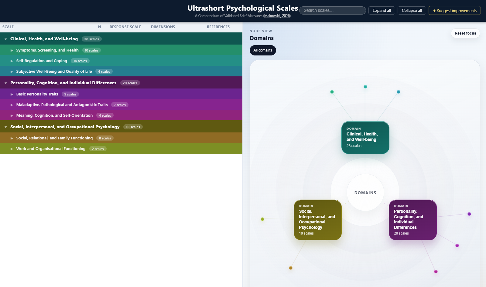

# Compendium of Ultra-Short Psychology Questionnaires

This repository contains the code for a website that compiles a list of well-established ultra-short psychological questionnaires.

- [**https://realitybending.github.io/UltraShortScales/**](https://realitybending.github.io/UltraShortScales/)

[](https://realitybending.github.io/UltraShortScales/)

## Contribute

Know of any well-established short questionnaires? Share the reference by opening an issue or submitting a pull request.

## Cite

To cite, please use:

> Makowski, D. (2026). Ultrashort Psychological Scales: A Compendium of Validated Brief Measures (Version 1.0.0) [Computer software]. https://github.com/RealityBending/UltraShortScales

```
@software{Makowski_Ultrashort_Psychological_Scales_2026,
author = {Makowski, Dominique},
license = {MIT},
month = apr,
title = {{Ultrashort Psychological Scales: A Compendium of Validated Brief Measures}},
url = {https://github.com/RealityBending/UltraShortScales},
version = {1.0.0},
year = {2026}
}
```` 